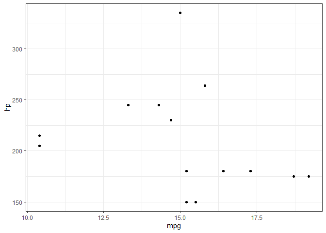

``` r
pacman::p_load(
    rio,            # import and export files
    here,           # locate files 
    tidyverse,      # data management and visualization
    glue
)
```

# Data


``` r
# data #-----------
(data <- rio::import(here("gnu_make/data_mtcars.csv")) %>% 
     tibble())
```

```
## # A tibble: 32 × 11
##      mpg   cyl  disp    hp  drat    wt  qsec    vs    am  gear  carb
##    <dbl> <int> <dbl> <int> <dbl> <dbl> <dbl> <int> <int> <int> <int>
##  1  21       6  160    110  3.9   2.62  16.5     0     1     4     4
##  2  21       6  160    110  3.9   2.88  17.0     0     1     4     4
##  3  22.8     4  108     93  3.85  2.32  18.6     1     1     4     1
##  4  21.4     6  258    110  3.08  3.22  19.4     1     0     3     1
##  5  18.7     8  360    175  3.15  3.44  17.0     0     0     3     2
##  6  18.1     6  225    105  2.76  3.46  20.2     1     0     3     1
##  7  14.3     8  360    245  3.21  3.57  15.8     0     0     3     4
##  8  24.4     4  147.    62  3.69  3.19  20       1     0     4     2
##  9  22.8     4  141.    95  3.92  3.15  22.9     1     0     4     2
## 10  19.2     6  168.   123  3.92  3.44  18.3     1     0     4     4
## # ℹ 22 more rows
```

``` r
(res <- data %>% 
        filter(.data[[params$variable]] == params$selected_value))
```

```
## # A tibble: 14 × 11
##      mpg   cyl  disp    hp  drat    wt  qsec    vs    am  gear  carb
##    <dbl> <int> <dbl> <int> <dbl> <dbl> <dbl> <int> <int> <int> <int>
##  1  18.7     8  360    175  3.15  3.44  17.0     0     0     3     2
##  2  14.3     8  360    245  3.21  3.57  15.8     0     0     3     4
##  3  16.4     8  276.   180  3.07  4.07  17.4     0     0     3     3
##  4  17.3     8  276.   180  3.07  3.73  17.6     0     0     3     3
##  5  15.2     8  276.   180  3.07  3.78  18       0     0     3     3
##  6  10.4     8  472    205  2.93  5.25  18.0     0     0     3     4
##  7  10.4     8  460    215  3     5.42  17.8     0     0     3     4
##  8  14.7     8  440    230  3.23  5.34  17.4     0     0     3     4
##  9  15.5     8  318    150  2.76  3.52  16.9     0     0     3     2
## 10  15.2     8  304    150  3.15  3.44  17.3     0     0     3     2
## 11  13.3     8  350    245  3.73  3.84  15.4     0     0     3     4
## 12  19.2     8  400    175  3.08  3.84  17.0     0     0     3     2
## 13  15.8     8  351    264  4.22  3.17  14.5     0     1     5     4
## 14  15       8  301    335  3.54  3.57  14.6     0     1     5     8
```

``` r
rio::export(res,
            glue(here(),
                 "/parameterized_report/processed_{params$variable}_{params$selected_value}.csv"))
```

# Plot


``` r
# plot #------------------------
(data <- rio::import(glue(here(), "/parameterized_report/processed_{params$variable}_{params$selected_value}.csv")) %>% 
     tibble())
```

```
## # A tibble: 14 × 11
##      mpg   cyl  disp    hp  drat    wt  qsec    vs    am  gear  carb
##    <dbl> <int> <dbl> <int> <dbl> <dbl> <dbl> <int> <int> <int> <int>
##  1  18.7     8  360    175  3.15  3.44  17.0     0     0     3     2
##  2  14.3     8  360    245  3.21  3.57  15.8     0     0     3     4
##  3  16.4     8  276.   180  3.07  4.07  17.4     0     0     3     3
##  4  17.3     8  276.   180  3.07  3.73  17.6     0     0     3     3
##  5  15.2     8  276.   180  3.07  3.78  18       0     0     3     3
##  6  10.4     8  472    205  2.93  5.25  18.0     0     0     3     4
##  7  10.4     8  460    215  3     5.42  17.8     0     0     3     4
##  8  14.7     8  440    230  3.23  5.34  17.4     0     0     3     4
##  9  15.5     8  318    150  2.76  3.52  16.9     0     0     3     2
## 10  15.2     8  304    150  3.15  3.44  17.3     0     0     3     2
## 11  13.3     8  350    245  3.73  3.84  15.4     0     0     3     4
## 12  19.2     8  400    175  3.08  3.84  17.0     0     0     3     2
## 13  15.8     8  351    264  4.22  3.17  14.5     0     1     5     4
## 14  15       8  301    335  3.54  3.57  14.6     0     1     5     8
```

``` r
fig <- data %>% 
    ggplot(aes(x = mpg, y = hp)) +
    geom_point() +
    theme_bw()

fig
```

<!-- -->

``` r
lehuynh::ggsave_elsevier(glue(here(), "/parameterized_report/plot_{params$variable}_{params$selected_value}.png"),
                         fig,
                         width = "one_column",
                         height = 240/3)
```

